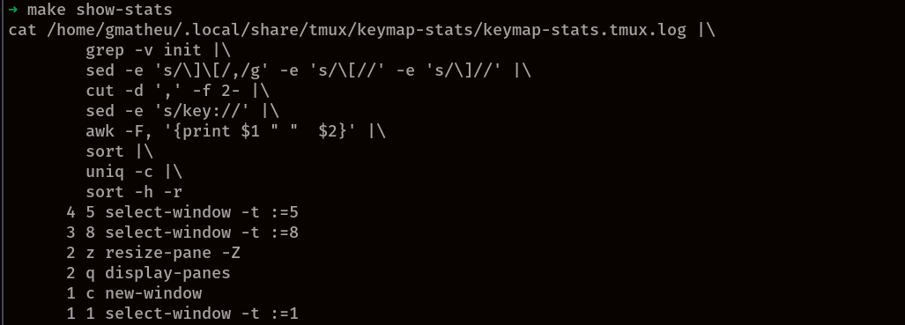

# keymap-stats.tmux plugin

Tracks tmux keymap usage by user.

It does that by instrumenting all keybindings in tmux prefixing a command to log that the key was pressed.

You can get a usage report like this:



## Installation

Using TPM, add this to your `.tmux.conf`

```shell
set -g @plugin 'gmatheu/keymap-stats.tmux'
```

Reload tmux config (`<prefix>-I`). Also you may want to start a fresh session to
reload `$PATH` into your environment.

### or Manually

Clone this repository and execute `make instrument`
